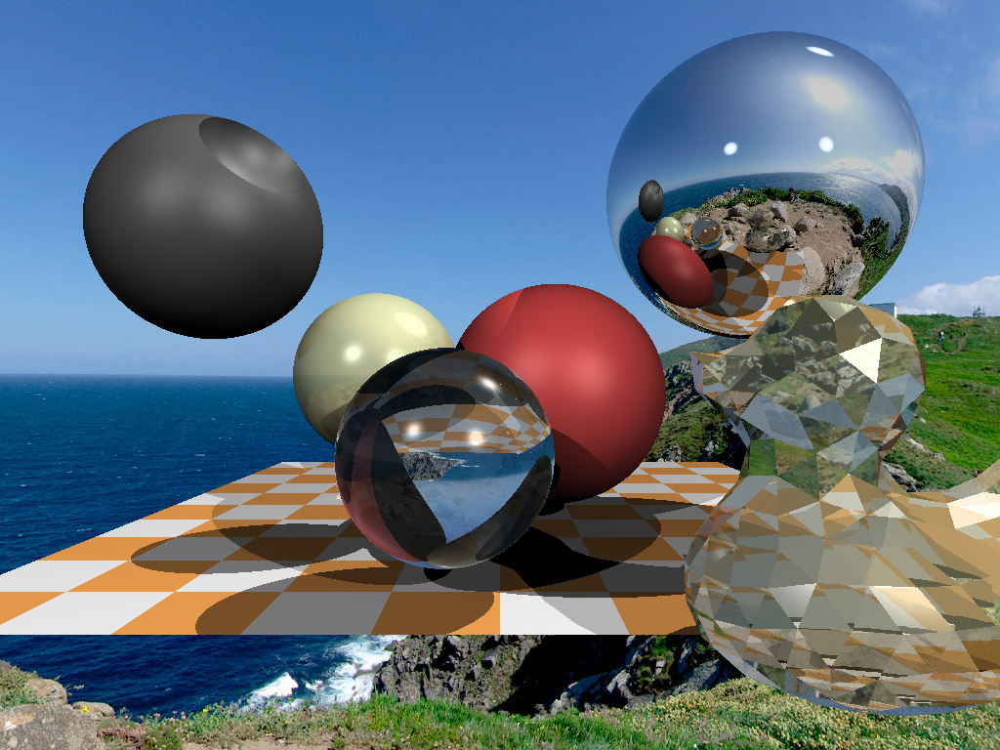
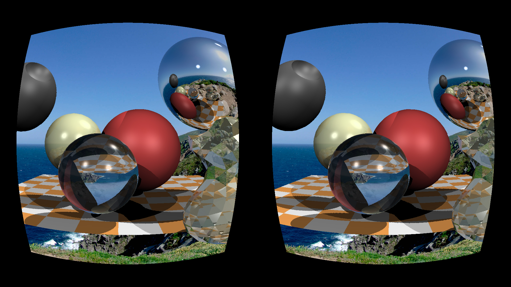

# Homework assignment

## compilation
```sh
git clone https://github.com/romainduc421/mytinyraytracer/
cd mytinyraytracer
mkdir build
cd build
cmake ..  
make
./tinyraytracer
```
NB : le programme n'effectue que l'un des 3 rendus (2 autres à décommenter si vous voulez les tester)

## Rendus :
### normal 


### anaglyph


### stereoscope
